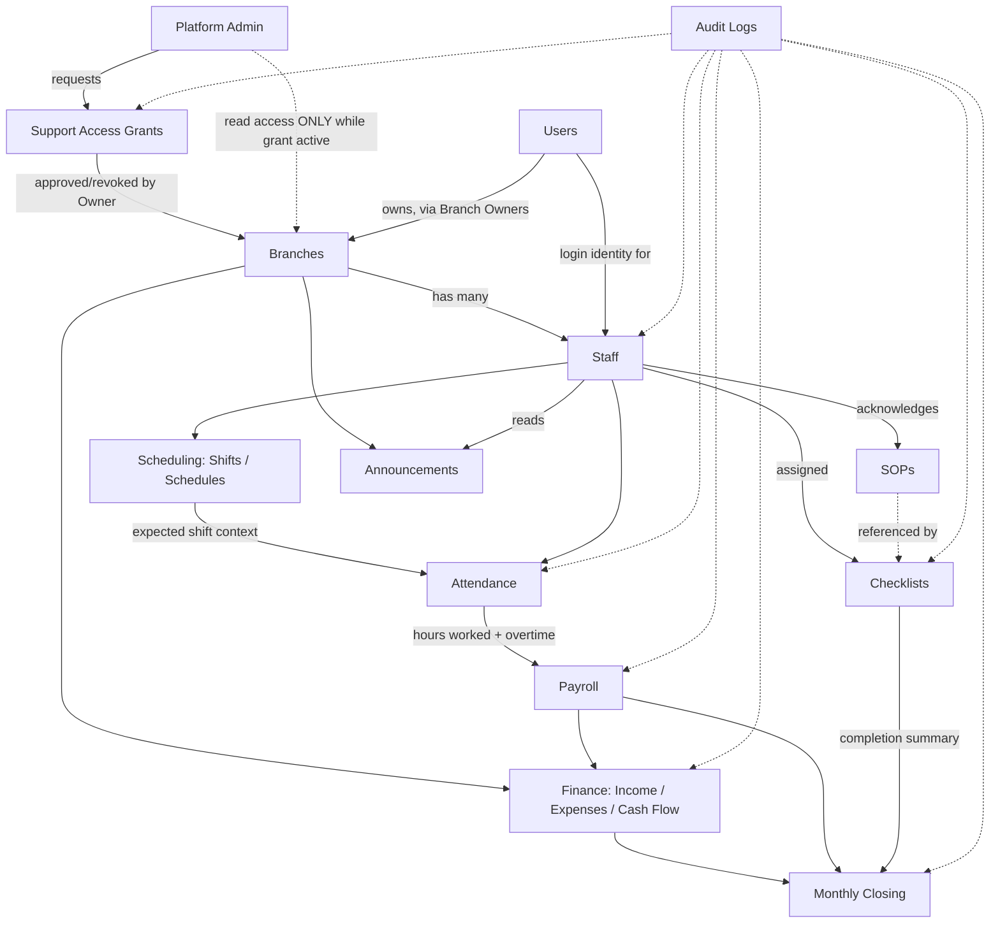

# Tenderista — Database Schema

Status: **planning only — no code written yet.** Companion to [PLANNING.md](PLANNING.md).
Target: PostgreSQL (uses `pgcrypto` for `gen_random_uuid()`), RLS-enforced multi-tenancy.

---

## 0. Conventions (apply to every table unless noted)

- **Primary key**: `id UUID PRIMARY KEY DEFAULT gen_random_uuid()`
- **Timestamps**: `created_at TIMESTAMPTZ NOT NULL DEFAULT now()` on every table; `updated_at TIMESTAMPTZ NOT NULL DEFAULT now()` on every mutable table (maintained by app layer or a trigger).
- **Money**: `NUMERIC(12,2)` for staff/expense-level amounts, `NUMERIC(14,2)` for branch-level rollups (income, cash flow, closing totals) — headroom for aggregation, still exact decimal.
- **Denormalized `branch_id`**: every table — including detail/child tables reachable only through a parent FK — carries its own `branch_id`. This is intentional duplication so every Row-Level Security policy is a single flat `branch_id` check, not a multi-table join. Kept consistent with the parent at insert time by the application layer (or a `BEFORE INSERT` trigger copying it from the parent row).
- **Branch deletion**: branches are never hard-deleted (only suspended), so `branch_id` foreign keys use `ON DELETE RESTRICT` throughout.
- **Soft delete**: used only where the audit requirement demands the deleted row remain inspectable (`expenses`); everywhere else, deletion is either disallowed at the application layer or simply uncommon enough not to need it.

### Custom enum types

| Enum | Values |
|---|---|
| `admin_status_enum` | active, suspended |
| `branch_status_enum` | active, suspended |
| `grant_status_enum` | pending, approved, denied, revoked, expired |
| `actor_type_enum` | platform_admin, user |
| `user_status_enum` | active, inactive, suspended |
| `staff_role_enum` | manager, staff |
| `employment_status_enum` | probation, active, on_leave, resigned, terminated |
| `salary_type_enum` | monthly, hourly |
| `staff_status_enum` | active, inactive |
| `attendance_status_enum` | present, late, absent, on_leave |
| `leave_type_enum` | annual, medical, emergency, unpaid, other |
| `leave_status_enum` | pending, approved, rejected, cancelled |
| `checklist_type_enum` | opening, closing, kitchen, weekly_cleaning, monthly_audit, custom |
| `recurrence_type_enum` | daily, weekly, monthly |
| `assigned_type_enum` | staff, role, shift |
| `checklist_instance_status_enum` | pending, in_progress, pending_review, approved |
| `attachment_type_enum` | image, document, video |
| `announcement_target_enum` | branch, role, individual |
| `income_type_enum` | sales, other |
| `income_channel_enum` | walk_in, foodpanda, grabfood, other |
| `income_status_enum` | received, pending |
| `expense_status_enum` | paid, unpaid |
| `account_type_enum` | cash, bank, ewallet |
| `cash_flow_type_enum` | income, expense, transfer, withdrawal, capital_injection, refund, adjustment |
| `payroll_status_enum` | draft, finalized, paid |
| `closing_status_enum` | draft, locked, reopened |

### Row-Level Security strategy

Two session variables are set per request by the app (via `proxy.ts` + the auth layer): `app.current_user_id` (a `users.id`, if logged in as Owner/Manager/Staff) or `app.current_platform_admin_id` (if logged in as Platform Admin), and `app.current_branch_id` (the active branch context).

Every branch-scoped table gets a policy shaped like:

```sql
USING (
  branch_id = current_setting('app.current_branch_id', true)::uuid
  AND (
    EXISTS (SELECT 1 FROM branch_owners bo
            WHERE bo.branch_id = branch_id AND bo.user_id = current_setting('app.current_user_id', true)::uuid)
    OR EXISTS (SELECT 1 FROM staff s
               WHERE s.branch_id = branch_id AND s.user_id = current_setting('app.current_user_id', true)::uuid)
    OR EXISTS (SELECT 1 FROM support_access_grants g
               WHERE g.branch_id = branch_id
                 AND g.requested_by = current_setting('app.current_platform_admin_id', true)::uuid
                 AND g.status = 'approved' AND now() < g.expires_at)
  )
)
```

This is the **only** path by which a Platform Admin session can read a row — there is no blanket bypass. `role_permissions` is a separate, application-layer authorization check on top of this: RLS decides *whether a row is visible at all*, `role_permissions` decides *what a Manager/Staff session is allowed to do with it*. Financial tables add a further application-layer rule: Staff can never reach them regardless of RLS, and Manager access requires an explicit `role_permissions` grant per financial sub-module (income/expenses/cash-flow/payroll).

### ORM

**Decision: Prisma.** No strong technical reason to prefer Drizzle here. RLS policies (§ above) aren't something either ORM manages natively as schema — both require the policies to be added as raw SQL alongside the generated migration. Prisma's well-established pattern is to let `prisma migrate dev` generate the table/enum DDL, then append the `CREATE POLICY ...` statements to that same migration file by hand; that's sufficient for this project's needs. Prisma's broader ecosystem, generated type-safe client, and mainstream Next.js tooling support outweigh the marginal edge-runtime/SQL-proximity advantages Drizzle would offer — advantages that would only matter if this project needed to run its database layer inside an edge runtime (e.g. Cloudflare Workers), which it doesn't.

---

## 1. Platform-level tables

### `platform_admins`
**Purpose:** Tenderista HQ administrator accounts. Never branch-scoped.

| Column | Type | Constraints |
|---|---|---|
| id | UUID | PK, default `gen_random_uuid()` |
| name | VARCHAR(150) | NOT NULL |
| email | VARCHAR(255) | NOT NULL, UNIQUE |
| password_hash | TEXT | NOT NULL |
| status | admin_status_enum | NOT NULL, DEFAULT 'active' |
| created_at | TIMESTAMPTZ | NOT NULL, DEFAULT now() |
| updated_at | TIMESTAMPTZ | NOT NULL, DEFAULT now() |

- **Primary key:** `id`
- **Foreign keys:** none
- **Relationships:** referenced by `support_access_grants.requested_by`, `audit_logs.actor_platform_admin_id`
- **Indexes:** unique index on `email`
- **Constraints:** `email` unique/not null
- **Notes:** Not subject to branch RLS policies — this table has its own admin-only access rule (only platform admins can read platform admin rows).

---

### `branches`
**Purpose:** The tenant root — one independent restaurant branch workspace.

| Column | Type | Constraints |
|---|---|---|
| id | UUID | PK |
| name | VARCHAR(150) | NOT NULL |
| slug | VARCHAR(100) | NOT NULL, UNIQUE |
| address | TEXT | NULL |
| timezone | VARCHAR(50) | NOT NULL, DEFAULT 'Asia/Kuala_Lumpur' |
| currency | CHAR(3) | NOT NULL, DEFAULT 'MYR' |
| status | branch_status_enum | NOT NULL, DEFAULT 'active' |
| created_by | UUID | NULL, FK → platform_admins(id) ON DELETE SET NULL |
| created_at | TIMESTAMPTZ | NOT NULL |
| updated_at | TIMESTAMPTZ | NOT NULL |

- **Primary key:** `id`
- **Foreign keys:** `created_by` → `platform_admins(id)`
- **Relationships:** parent of every branch-scoped table via `branch_id`
- **Indexes:** unique on `slug`
- **Constraints:** `slug` unique/not null
- **Notes:** Root tenant entity; never hard-deleted, only suspended.

---

### `support_access_grants`
**Purpose:** The sole mechanism allowing a Platform Admin temporary, audited read access into one branch.

| Column | Type | Constraints |
|---|---|---|
| id | UUID | PK |
| branch_id | UUID | NOT NULL, FK → branches(id) ON DELETE RESTRICT |
| requested_by | UUID | NOT NULL, FK → platform_admins(id) |
| reason | TEXT | NOT NULL |
| status | grant_status_enum | NOT NULL, DEFAULT 'pending' |
| approved_by | UUID | NULL, FK → users(id) |
| granted_at | TIMESTAMPTZ | NULL |
| expires_at | TIMESTAMPTZ | NULL |
| revoked_at | TIMESTAMPTZ | NULL |
| revoked_by | UUID | NULL, FK → users(id) |
| created_at | TIMESTAMPTZ | NOT NULL |
| updated_at | TIMESTAMPTZ | NOT NULL |

- **Primary key:** `id`
- **Foreign keys:** `branch_id` → `branches(id)`; `requested_by` → `platform_admins(id)`; `approved_by`, `revoked_by` → `users(id)`
- **Relationships:** referenced by `audit_logs.grant_id`; consulted directly inside every branch-scoped RLS policy
- **Indexes:** `(branch_id, status)`, `(requested_by, status)`, `(expires_at)` for the expiry-sweep job
- **Constraints:** `CHECK (expires_at IS NULL OR expires_at > granted_at)`
- **Notes:** State transitions (`pending → approved/denied`, `approved → revoked/expired`) are enforced at the application layer, not the DB.

---

### `audit_logs`
**Purpose:** Unified, append-only audit trail spanning platform and branch actions.

| Column | Type | Constraints |
|---|---|---|
| id | UUID | PK |
| branch_id | UUID | NULL, FK → branches(id) ON DELETE RESTRICT |
| actor_type | actor_type_enum | NOT NULL |
| actor_platform_admin_id | UUID | NULL, FK → platform_admins(id) |
| actor_user_id | UUID | NULL, FK → users(id) |
| action | VARCHAR(100) | NOT NULL |
| entity_type | VARCHAR(100) | NOT NULL |
| entity_id | UUID | NULL |
| metadata | JSONB | NULL |
| grant_id | UUID | NULL, FK → support_access_grants(id) |
| created_at | TIMESTAMPTZ | NOT NULL |

- **Primary key:** `id`
- **Foreign keys:** `branch_id`, `actor_platform_admin_id`, `actor_user_id`, `grant_id`
- **Relationships:** loosely references any table via `(entity_type, entity_id)` — intentionally not a real FK since `entity_type` varies (order/checklist/expense/etc.); this is a log, not a relational integrity boundary
- **Indexes:** `(branch_id, created_at DESC)`, `(entity_type, entity_id)`, `(actor_user_id)`, `(action)`
- **Constraints:** `CHECK ((actor_type='platform_admin' AND actor_platform_admin_id IS NOT NULL AND actor_user_id IS NULL) OR (actor_type='user' AND actor_user_id IS NOT NULL AND actor_platform_admin_id IS NULL))`
- **Notes:** Application exposes no UPDATE/DELETE endpoint for this table; a DB trigger rejecting UPDATE/DELETE is recommended to make append-only structural, not just conventional.

---

## 2. Identity tables

### `users`
**Purpose:** One login identity per human who is an Owner, Manager, or Staff member — shared across every branch they're involved with.

| Column | Type | Constraints |
|---|---|---|
| id | UUID | PK |
| name | VARCHAR(150) | NOT NULL |
| email | VARCHAR(255) | NULL, UNIQUE |
| phone | VARCHAR(30) | NULL, UNIQUE |
| password_hash | TEXT | NOT NULL |
| status | user_status_enum | NOT NULL, DEFAULT 'active' |
| created_at | TIMESTAMPTZ | NOT NULL |
| updated_at | TIMESTAMPTZ | NOT NULL |

- **Primary key:** `id`
- **Foreign keys:** none
- **Relationships:** referenced by `branch_owners.user_id`, `staff.user_id`, and as the generic "actor" FK (`entered_by`, `created_by`, `approved_by`, `completed_by`, `finalized_by`, etc.) across nearly every branch module
- **Indexes:** unique partial index on `email WHERE email IS NOT NULL`; unique partial index on `phone WHERE phone IS NOT NULL`
- **Constraints:** `CHECK (email IS NOT NULL OR phone IS NOT NULL)`
- **Notes:** Not branch-scoped — this is what makes "one login, multiple branches" possible.

---

### `branch_owners`
**Purpose:** Grants a user full Owner-level access to a branch; join table enabling one login across multiple branches.

| Column | Type | Constraints |
|---|---|---|
| id | UUID | PK |
| user_id | UUID | NOT NULL, FK → users(id) ON DELETE CASCADE |
| branch_id | UUID | NOT NULL, FK → branches(id) ON DELETE RESTRICT |
| is_primary_owner | BOOLEAN | NOT NULL, DEFAULT true |
| created_at | TIMESTAMPTZ | NOT NULL |

- **Primary key:** `id`
- **Foreign keys:** `user_id` → `users(id)`; `branch_id` → `branches(id)`
- **Relationships:** many-to-many between `users` and `branches` (Owner side only — a branch could have co-owners)
- **Indexes:** unique `(user_id, branch_id)`; index on `branch_id`
- **Constraints:** unique `(user_id, branch_id)`
- **Notes:** Owner access via this table is always full access within the branch, not subject to `role_permissions`.

---

## 3. Staff module

### `staff`
**Purpose:** Branch-specific employment record for Managers and Staff (Owners are tracked separately via `branch_owners`).

| Column | Type | Constraints |
|---|---|---|
| id | UUID | PK |
| branch_id | UUID | NOT NULL, FK → branches(id) ON DELETE RESTRICT |
| user_id | UUID | NOT NULL, FK → users(id) ON DELETE RESTRICT |
| role | staff_role_enum | NOT NULL |
| job_position | VARCHAR(100) | NOT NULL |
| employment_status | employment_status_enum | NOT NULL, DEFAULT 'active' |
| start_date | DATE | NOT NULL |
| end_date | DATE | NULL |
| salary_type | salary_type_enum | NOT NULL |
| basic_salary | NUMERIC(12,2) | NULL |
| hourly_rate | NUMERIC(12,2) | NULL |
| status | staff_status_enum | NOT NULL, DEFAULT 'active' |
| notes | TEXT | NULL |
| created_at | TIMESTAMPTZ | NOT NULL |
| updated_at | TIMESTAMPTZ | NOT NULL |

- **Primary key:** `id`
- **Foreign keys:** `branch_id`, `user_id`
- **Relationships:** parent of `staff_documents`, `attendance_records`, `schedules`, `leave_requests`, `payroll_records`, `sop_acknowledgements`, `announcement_reads`
- **Indexes:** unique `(branch_id, user_id)`; `(branch_id, status)`; `(user_id)`
- **Constraints:** unique `(branch_id, user_id)`; `CHECK ((salary_type='monthly' AND basic_salary IS NOT NULL) OR (salary_type='hourly' AND hourly_rate IS NOT NULL))`
- **Notes:** A user can be Owner of one branch and Staff/Manager of another — role resolution always checks `branch_owners` first, then `staff`, per active branch context.

---

### `staff_documents`
**Purpose:** Uploaded documents/notes attached to a staff record.

| Column | Type | Constraints |
|---|---|---|
| id | UUID | PK |
| branch_id | UUID | NOT NULL, FK → branches(id) ON DELETE RESTRICT |
| staff_id | UUID | NOT NULL, FK → staff(id) ON DELETE CASCADE |
| file_url | TEXT | NOT NULL |
| type | VARCHAR(50) | NULL |
| note | TEXT | NULL |
| uploaded_by | UUID | NOT NULL, FK → users(id) |
| created_at | TIMESTAMPTZ | NOT NULL |

- **Primary key:** `id`
- **Foreign keys:** `branch_id`, `staff_id`, `uploaded_by`
- **Relationships:** child of `staff`
- **Indexes:** `(staff_id)`
- **Constraints:** none beyond FK/not null
- **Notes:** —

---

### `role_permissions`
**Purpose:** Owner-configurable permission matrix per role, per branch.

| Column | Type | Constraints |
|---|---|---|
| id | UUID | PK |
| branch_id | UUID | NOT NULL, FK → branches(id) ON DELETE RESTRICT |
| role | staff_role_enum | NOT NULL |
| module | VARCHAR(50) | NOT NULL |
| action | VARCHAR(50) | NOT NULL |
| allowed | BOOLEAN | NOT NULL, DEFAULT false |
| updated_by | UUID | NULL, FK → users(id) |
| created_at | TIMESTAMPTZ | NOT NULL |
| updated_at | TIMESTAMPTZ | NOT NULL |

- **Primary key:** `id`
- **Foreign keys:** `branch_id`, `updated_by`
- **Relationships:** consulted at authorization time for every Manager/Staff action; `module` values include `staff`, `attendance`, `checklists`, `sops`, `announcements`, `financials.income`, `financials.expenses`, `financials.cash_flow`, `financials.payroll`, `closing`
- **Indexes:** unique `(branch_id, role, module, action)`; `(branch_id, role)`
- **Constraints:** unique `(branch_id, role, module, action)`
- **Notes:** Owner is not represented here (always full access). Seed rows are created from a default template when a branch is provisioned.

---

## 4. Attendance & Scheduling module

### `shifts`
**Purpose:** Reusable shift templates (e.g. "Morning 8am–4pm").

| Column | Type | Constraints |
|---|---|---|
| id | UUID | PK |
| branch_id | UUID | NOT NULL, FK → branches(id) ON DELETE RESTRICT |
| name | VARCHAR(100) | NOT NULL |
| start_time | TIME | NOT NULL |
| end_time | TIME | NOT NULL |
| created_at | TIMESTAMPTZ | NOT NULL |
| updated_at | TIMESTAMPTZ | NOT NULL |

- **Primary key:** `id`
- **Foreign keys:** `branch_id`
- **Relationships:** referenced by `schedules.shift_id`, `checklist_instances.assigned_shift_id`
- **Indexes:** `(branch_id)`
- **Constraints:** none beyond FK
- **Notes:** `end_time < start_time` is allowed and interpreted as an overnight shift by the application layer.

---

### `schedules`
**Purpose:** A staff member's assigned shift (or off day) for a specific date.

| Column | Type | Constraints |
|---|---|---|
| id | UUID | PK |
| branch_id | UUID | NOT NULL, FK → branches(id) ON DELETE RESTRICT |
| staff_id | UUID | NOT NULL, FK → staff(id) ON DELETE CASCADE |
| shift_id | UUID | NULL, FK → shifts(id) ON DELETE SET NULL |
| date | DATE | NOT NULL |
| is_off_day | BOOLEAN | NOT NULL, DEFAULT false |
| created_at | TIMESTAMPTZ | NOT NULL |
| updated_at | TIMESTAMPTZ | NOT NULL |

- **Primary key:** `id`
- **Foreign keys:** `branch_id`, `staff_id`, `shift_id`
- **Relationships:** provides the expected-shift context for `attendance_records` (lateness comparison)
- **Indexes:** unique `(staff_id, date)`; `(branch_id, date)`
- **Constraints:** unique `(staff_id, date)`; `CHECK (NOT is_off_day OR shift_id IS NULL)`
- **Notes:** —

---

### `attendance_records`
**Purpose:** Actual clock-in/out record for a staff member on a given date.

| Column | Type | Constraints |
|---|---|---|
| id | UUID | PK |
| branch_id | UUID | NOT NULL, FK → branches(id) ON DELETE RESTRICT |
| staff_id | UUID | NOT NULL, FK → staff(id) ON DELETE CASCADE |
| schedule_id | UUID | NULL, FK → schedules(id) ON DELETE SET NULL |
| date | DATE | NOT NULL |
| clock_in_at | TIMESTAMPTZ | NULL |
| clock_out_at | TIMESTAMPTZ | NULL |
| worked_hours | NUMERIC(6,2) | NOT NULL, DEFAULT 0 |
| overtime_hours | NUMERIC(6,2) | NOT NULL, DEFAULT 0 |
| status | attendance_status_enum | NOT NULL, DEFAULT 'present' |
| edited_by | UUID | NULL, FK → users(id) |
| created_at | TIMESTAMPTZ | NOT NULL |
| updated_at | TIMESTAMPTZ | NOT NULL |

- **Primary key:** `id`
- **Foreign keys:** `branch_id`, `staff_id`, `schedule_id`, `edited_by`
- **Relationships:** parent of `break_records`; primary source data for `payroll_records.computed_regular_hours`/`computed_overtime_hours`
- **Indexes:** unique `(staff_id, date)`; `(branch_id, date)`
- **Constraints:** unique `(staff_id, date)`; `CHECK (clock_out_at IS NULL OR clock_out_at > clock_in_at)`
- **Notes:** `worked_hours` and `overtime_hours` are **application-maintained, plain columns — not DB `GENERATED` columns.** The app recalculates both from `clock_in_at`/`clock_out_at` minus `break_records` duration whenever the record changes, splitting the total against `payroll_settings.standard_hours_per_day` (hours up to the standard go to `worked_hours`, the remainder to `overtime_hours`). `clock_in_at`/`clock_out_at`/`break_records` are never overwritten by this recalculation — they remain the source values, so any computed figure can always be traced back and re-derived. Any post-hoc edit to clock times must be audit-logged (`action = 'attendance.edit'`) — enforced at the application layer.

---

### `break_records`
**Purpose:** Break start/end within a single attendance record.

| Column | Type | Constraints |
|---|---|---|
| id | UUID | PK |
| branch_id | UUID | NOT NULL, FK → branches(id) ON DELETE RESTRICT |
| attendance_id | UUID | NOT NULL, FK → attendance_records(id) ON DELETE CASCADE |
| break_start | TIMESTAMPTZ | NOT NULL |
| break_end | TIMESTAMPTZ | NULL |
| created_at | TIMESTAMPTZ | NOT NULL |

- **Primary key:** `id`
- **Foreign keys:** `branch_id`, `attendance_id`
- **Relationships:** child of `attendance_records`; subtracted when computing `worked_hours`
- **Indexes:** `(attendance_id)`
- **Constraints:** `CHECK (break_end IS NULL OR break_end > break_start)`
- **Notes:** —

---

### `leave_requests`
**Purpose:** Staff-submitted leave requiring Manager/Owner approval.

| Column | Type | Constraints |
|---|---|---|
| id | UUID | PK |
| branch_id | UUID | NOT NULL, FK → branches(id) ON DELETE RESTRICT |
| staff_id | UUID | NOT NULL, FK → staff(id) ON DELETE CASCADE |
| type | leave_type_enum | NOT NULL |
| start_date | DATE | NOT NULL |
| end_date | DATE | NOT NULL |
| reason | TEXT | NULL |
| status | leave_status_enum | NOT NULL, DEFAULT 'pending' |
| approved_by | UUID | NULL, FK → users(id) |
| decided_at | TIMESTAMPTZ | NULL |
| review_notes | TEXT | NULL |
| created_at | TIMESTAMPTZ | NOT NULL |
| updated_at | TIMESTAMPTZ | NOT NULL |

- **Primary key:** `id`
- **Foreign keys:** `branch_id`, `staff_id`, `approved_by`
- **Relationships:** approved leave is reflected into `schedules` (as off days) and `attendance_records.status = 'on_leave'` for the covered dates — not implemented in V1 (see Leave Management V1); a future follow-up
- **Indexes:** `(branch_id, status)`; `(staff_id, start_date)`
- **Constraints:** `CHECK (end_date >= start_date)`
- **Notes:** —

---

## 5. Checklists & SOPs module

### `checklist_templates`
**Purpose:** Defines a recurring or one-off checklist and its recurrence rule.

| Column | Type | Constraints |
|---|---|---|
| id | UUID | PK |
| branch_id | UUID | NOT NULL, FK → branches(id) ON DELETE RESTRICT |
| name | VARCHAR(150) | NOT NULL |
| type | checklist_type_enum | NOT NULL |
| recurrence_type | recurrence_type_enum | NOT NULL |
| weekdays | SMALLINT[] | NULL |
| day_of_month | SMALLINT | NULL |
| start_date | DATE | NOT NULL |
| end_date | DATE | NULL |
| is_active | BOOLEAN | NOT NULL, DEFAULT true |
| created_by | UUID | NOT NULL, FK → users(id) |
| created_at | TIMESTAMPTZ | NOT NULL |
| updated_at | TIMESTAMPTZ | NOT NULL |

- **Primary key:** `id`
- **Foreign keys:** `branch_id`, `created_by`
- **Relationships:** parent of `checklist_template_items`; source template for auto-generated `checklist_instances`
- **Indexes:** `(branch_id, is_active)`; `(branch_id, recurrence_type)`
- **Constraints:** `CHECK (recurrence_type != 'weekly' OR weekdays IS NOT NULL)`; `CHECK (recurrence_type != 'monthly' OR day_of_month IS NOT NULL)`; `CHECK (day_of_month IS NULL OR day_of_month BETWEEN 1 AND 31)`; `CHECK (end_date IS NULL OR end_date >= start_date)`
- **Notes:** Structured recurrence, not free text. `recurrence_type = 'daily'` runs every day between `start_date` and `end_date` (or indefinitely if `end_date IS NULL`). `recurrence_type = 'weekly'` uses `weekdays` (ISO 1=Monday…7=Sunday) — a single day covers a plain "weekly" checklist, multiple days covers "selected weekdays" (e.g. Mon/Wed/Fri). `recurrence_type = 'monthly'` uses `day_of_month` (1–31; the generation job clamps to the last day for shorter months, e.g. 31 → Feb 28/29). `is_active = false` pauses generation without deleting the template or its history. A scheduled job reads active templates whose `start_date`/`end_date` window covers "today" and creates `checklist_instances` accordingly.

---

### `checklist_template_items`
**Purpose:** Individual line items within a checklist template.

| Column | Type | Constraints |
|---|---|---|
| id | UUID | PK |
| branch_id | UUID | NOT NULL, FK → branches(id) ON DELETE RESTRICT |
| template_id | UUID | NOT NULL, FK → checklist_templates(id) ON DELETE CASCADE |
| description | TEXT | NOT NULL |
| requires_photo | BOOLEAN | NOT NULL, DEFAULT false |
| requires_note | BOOLEAN | NOT NULL, DEFAULT false |
| sop_id | UUID | NULL, FK → sops(id) ON DELETE SET NULL |
| sort_order | INTEGER | NOT NULL, DEFAULT 0 |
| created_at | TIMESTAMPTZ | NOT NULL |
| updated_at | TIMESTAMPTZ | NOT NULL |

- **Primary key:** `id`
- **Foreign keys:** `branch_id`, `template_id`, `sop_id`
- **Relationships:** child of `checklist_templates`; optional link to a SOP; copied into `checklist_instance_items` at generation time
- **Indexes:** `(template_id, sort_order)`
- **Constraints:** none additional
- **Notes:** —

---

### `checklist_instances`
**Purpose:** A specific occurrence of a checklist due on/around a date.

| Column | Type | Constraints |
|---|---|---|
| id | UUID | PK |
| branch_id | UUID | NOT NULL, FK → branches(id) ON DELETE RESTRICT |
| template_id | UUID | NULL, FK → checklist_templates(id) ON DELETE SET NULL |
| due_at | TIMESTAMPTZ | NOT NULL |
| assigned_type | assigned_type_enum | NOT NULL |
| assigned_ref | UUID | NULL, FK → staff(id) ON DELETE SET NULL |
| assigned_role | staff_role_enum | NULL |
| assigned_shift_id | UUID | NULL, FK → shifts(id) ON DELETE SET NULL |
| status | checklist_instance_status_enum | NOT NULL, DEFAULT 'pending' |
| submitted_by | UUID | NULL, FK → users(id) |
| submitted_at | TIMESTAMPTZ | NULL |
| approved_by | UUID | NULL, FK → users(id) |
| approved_at | TIMESTAMPTZ | NULL |
| reopen_requested_by | UUID | NULL, FK → users(id) |
| reopen_requested_at | TIMESTAMPTZ | NULL |
| reopen_request_reason | TEXT | NULL |
| reopened_by | UUID | NULL, FK → users(id) |
| reopened_at | TIMESTAMPTZ | NULL |
| created_at | TIMESTAMPTZ | NOT NULL |
| updated_at | TIMESTAMPTZ | NOT NULL |

- **Primary key:** `id`
- **Foreign keys:** `branch_id`, `template_id`, `assigned_ref` → `staff(id)`, `assigned_shift_id`, `submitted_by`, `approved_by`, `reopen_requested_by`, `reopened_by`
- **Relationships:** parent of `checklist_instance_items`; generated from `checklist_templates`
- **Indexes:** `(branch_id, status, due_at)`; `(assigned_ref)`; `(template_id)`; `(branch_id, reopen_requested_at) WHERE reopen_requested_at IS NOT NULL` (drives the Owner/Manager reopen-request queue)
- **Constraints:** `CHECK ((assigned_type='staff' AND assigned_ref IS NOT NULL) OR (assigned_type='role' AND assigned_role IS NOT NULL) OR (assigned_type='shift' AND assigned_shift_id IS NOT NULL))`
- **Notes:** `assigned_ref` is only populated when `assigned_type='staff'`. **"Overdue" is not a stored status** — it's computed at read time (`due_at < now() AND status != 'approved'`) rather than flipped by a background job, since it's just a display concern, not a distinct workflow state (kept simple deliberately — see [[feedback_simplicity_low_taps]]).
  **Approval workflow:** `pending` (not started) → `in_progress` (some items done, not all required items satisfied yet) → `pending_review` (staff tapped "Complete Checklist"; all required items — including required photos/notes — are satisfied; `submitted_by`/`submitted_at` set) → `approved` (a Manager/Owner approved; `approved_by`/`approved_at` set; the instance and its items become read-only to Staff). While `pending_review`, the submitting staff member may still freely edit their own items/photos/notes — the instance stays in `pending_review`, it doesn't need to be re-submitted. Once `approved`, if changes are needed, Staff sets `reopen_requested_by`/`reopen_requested_at`/`reopen_request_reason`; only a Manager/Owner can act on that by reopening — which clears the three `reopen_requested_*` fields, sets `reopened_by`/`reopened_at`, and returns `status` to `'pending_review'` (editable again, exactly like a fresh submission). Every submit, approve, reopen-request, and reopen is written to `audit_logs`.

---

### `checklist_instance_items`
**Purpose:** Per-item completion record — the actual work log — within a checklist instance.

| Column | Type | Constraints |
|---|---|---|
| id | UUID | PK |
| branch_id | UUID | NOT NULL, FK → branches(id) ON DELETE RESTRICT |
| instance_id | UUID | NOT NULL, FK → checklist_instances(id) ON DELETE CASCADE |
| template_item_id | UUID | NULL, FK → checklist_template_items(id) ON DELETE SET NULL |
| description | TEXT | NOT NULL |
| requires_photo | BOOLEAN | NOT NULL, DEFAULT false |
| requires_note | BOOLEAN | NOT NULL, DEFAULT false |
| is_completed | BOOLEAN | NOT NULL, DEFAULT false |
| completed_by | UUID | NULL, FK → users(id) |
| completed_at | TIMESTAMPTZ | NULL |
| photo_url | TEXT | NULL |
| notes | TEXT | NULL |
| created_at | TIMESTAMPTZ | NOT NULL |
| updated_at | TIMESTAMPTZ | NOT NULL |

- **Primary key:** `id`
- **Foreign keys:** `branch_id`, `instance_id`, `template_item_id`, `completed_by`
- **Relationships:** child of `checklist_instances`
- **Indexes:** `(instance_id)`
- **Constraints:** `CHECK (NOT requires_photo OR NOT is_completed OR photo_url IS NOT NULL)`; `CHECK (NOT requires_note OR NOT is_completed OR notes IS NOT NULL)` (a DB trigger is recommended to enforce these precisely at the moment of completion)
- **Notes:** Approval is handled once, at the `checklist_instances` level (see its Notes) — not per item, to keep the workflow to a single clear gate rather than two overlapping approval concepts. Editability follows the parent instance's status: editable while the instance is `pending`/`in_progress`/`pending_review`, read-only once `approved`. Every completion edit is audit-logged.

---

### `sop_categories`
**Purpose:** Grouping for SOP documents.

| Column | Type | Constraints |
|---|---|---|
| id | UUID | PK |
| branch_id | UUID | NOT NULL, FK → branches(id) ON DELETE RESTRICT |
| name | VARCHAR(150) | NOT NULL |
| sort_order | INTEGER | NOT NULL, DEFAULT 0 |
| created_at | TIMESTAMPTZ | NOT NULL |
| updated_at | TIMESTAMPTZ | NOT NULL |

- **Primary key:** `id`
- **Foreign keys:** `branch_id`
- **Relationships:** parent of `sops`
- **Indexes:** `(branch_id)`
- **Constraints:** unique `(branch_id, name)`
- **Notes:** —

---

### `sops`
**Purpose:** A standard operating procedure document.

| Column | Type | Constraints |
|---|---|---|
| id | UUID | PK |
| branch_id | UUID | NOT NULL, FK → branches(id) ON DELETE RESTRICT |
| category_id | UUID | NOT NULL, FK → sop_categories(id) ON DELETE RESTRICT |
| title | VARCHAR(200) | NOT NULL |
| content | TEXT | NULL |
| created_by | UUID | NOT NULL, FK → users(id) |
| created_at | TIMESTAMPTZ | NOT NULL |
| updated_at | TIMESTAMPTZ | NOT NULL |

- **Primary key:** `id`
- **Foreign keys:** `branch_id`, `category_id`, `created_by`
- **Relationships:** parent of `sop_attachments`, `sop_acknowledgements`; referenced by `checklist_template_items.sop_id`
- **Indexes:** `(branch_id, category_id)`
- **Constraints:** none additional
- **Notes:** —

---

### `sop_attachments`
**Purpose:** Media attached to a SOP.

| Column | Type | Constraints |
|---|---|---|
| id | UUID | PK |
| branch_id | UUID | NOT NULL, FK → branches(id) ON DELETE RESTRICT |
| sop_id | UUID | NOT NULL, FK → sops(id) ON DELETE CASCADE |
| file_url | TEXT | NOT NULL |
| type | attachment_type_enum | NOT NULL |
| created_at | TIMESTAMPTZ | NOT NULL |

- **Primary key:** `id`
- **Foreign keys:** `branch_id`, `sop_id`
- **Relationships:** child of `sops`
- **Indexes:** `(sop_id)`
- **Constraints:** none additional
- **Notes:** —

---

### `sop_acknowledgements`
**Purpose:** Tracks that a staff member has read/acknowledged a SOP.

| Column | Type | Constraints |
|---|---|---|
| id | UUID | PK |
| branch_id | UUID | NOT NULL, FK → branches(id) ON DELETE RESTRICT |
| sop_id | UUID | NOT NULL, FK → sops(id) ON DELETE CASCADE |
| staff_id | UUID | NOT NULL, FK → staff(id) ON DELETE CASCADE |
| acknowledged_at | TIMESTAMPTZ | NOT NULL, DEFAULT now() |

- **Primary key:** `id`
- **Foreign keys:** `branch_id`, `sop_id`, `staff_id`
- **Relationships:** child of `sops` and `staff`
- **Indexes:** unique `(sop_id, staff_id)`
- **Constraints:** unique `(sop_id, staff_id)`
- **Notes:** Re-acknowledgement on SOP content changes (versioning) is a Phase 2 consideration, not modeled yet.

---

## 6. Announcements module

### `announcements`
**Purpose:** Owner/Manager-posted announcement targeted at a branch, role, or individual.

| Column | Type | Constraints |
|---|---|---|
| id | UUID | PK |
| branch_id | UUID | NOT NULL, FK → branches(id) ON DELETE RESTRICT |
| title | VARCHAR(200) | NOT NULL |
| body | TEXT | NOT NULL |
| created_by | UUID | NOT NULL, FK → users(id) |
| target_type | announcement_target_enum | NOT NULL |
| target_role | staff_role_enum | NULL |
| target_staff_id | UUID | NULL, FK → staff(id) ON DELETE CASCADE |
| created_at | TIMESTAMPTZ | NOT NULL |
| updated_at | TIMESTAMPTZ | NOT NULL |

- **Primary key:** `id`
- **Foreign keys:** `branch_id`, `created_by`, `target_staff_id`
- **Relationships:** parent of `announcement_reads`
- **Indexes:** `(branch_id, created_at DESC)`
- **Constraints:** `CHECK ((target_type='branch') OR (target_type='role' AND target_role IS NOT NULL) OR (target_type='individual' AND target_staff_id IS NOT NULL))`
- **Notes:** —

---

### `announcement_reads`
**Purpose:** Tracks which staff have read an announcement.

| Column | Type | Constraints |
|---|---|---|
| id | UUID | PK |
| branch_id | UUID | NOT NULL, FK → branches(id) ON DELETE RESTRICT |
| announcement_id | UUID | NOT NULL, FK → announcements(id) ON DELETE CASCADE |
| staff_id | UUID | NOT NULL, FK → staff(id) ON DELETE CASCADE |
| read_at | TIMESTAMPTZ | NOT NULL, DEFAULT now() |

- **Primary key:** `id`
- **Foreign keys:** `branch_id`, `announcement_id`, `staff_id`
- **Relationships:** child of `announcements` and `staff`
- **Indexes:** unique `(announcement_id, staff_id)`
- **Constraints:** unique `(announcement_id, staff_id)`
- **Notes:** —

---

## 7. Finance module

**UX convention (applies to every table below):** this module is presented to the Owner as a simple business money tracker, not accounting software — no debit/credit, journal, or ledger-posting terminology anywhere in the UI. `income_entries` and `expenses` are the two things an Owner directly manages ("Money In" / "Money Out"); `cash_flow_transactions` is populated automatically from them (see its notes) plus a small set of plain manual entry types (Owner Capital, Owner Withdrawal, Transfer, Refund, Correction/Adjustment). Edits and soft-deletes on all three follow the same rule: every edit is written to `audit_logs` with old value, new value, actor, and timestamp; every delete requires a reason and is soft (`deleted_at`/`deleted_by`/`deleted_reason`), never a hard delete, so a mistake stays reviewable rather than disappearing.

### `income_entries`
**Purpose:** Manually entered income totals — sales or other — by channel label only, no order-level detail.

| Column | Type | Constraints |
|---|---|---|
| id | UUID | PK |
| branch_id | UUID | NOT NULL, FK → branches(id) ON DELETE RESTRICT |
| date | DATE | NOT NULL |
| type | income_type_enum | NOT NULL |
| channel | income_channel_enum | NOT NULL, DEFAULT 'walk_in' |
| amount | NUMERIC(14,2) | NOT NULL |
| status | income_status_enum | NOT NULL, DEFAULT 'received' |
| account_id | UUID | NOT NULL, FK → accounts(id) ON DELETE RESTRICT |
| reference_number | VARCHAR(100) | NULL |
| receipt_image_url | TEXT | NULL |
| notes | TEXT | NULL |
| entered_by | UUID | NOT NULL, FK → users(id) |
| deleted_at | TIMESTAMPTZ | NULL |
| deleted_by | UUID | NULL, FK → users(id) |
| deleted_reason | TEXT | NULL |
| created_at | TIMESTAMPTZ | NOT NULL |
| updated_at | TIMESTAMPTZ | NOT NULL |

- **Primary key:** `id`
- **Foreign keys:** `branch_id`, `account_id`, `entered_by`, `deleted_by`
- **Relationships:** rolled up into `monthly_closings.total_sales`/`other_income`; **automatically** creates/updates one linked `cash_flow_transactions` row (type `income`) whenever `status='received'`, against `account_id` — the Owner never enters this twice
- **Indexes:** `(branch_id, date)`; `(branch_id, status)`; `(branch_id, deleted_at)`
- **Constraints:** `CHECK (amount >= 0)`
- **Notes:** `status='pending'` models delayed platform payouts (e.g. Foodpanda/GrabFood remittance) as a financial total only — no order-level integration; no linked cash-flow row is created until it flips to `'received'`. `channel` doubles as the simple "Category" field shown to the Owner (Walk-in / Foodpanda / GrabFood / Other). **Soft-deleted, not hard-deleted** (`deleted_at`/`deleted_by`/`deleted_reason`, reason required by the app) — deleting also reverses the linked `cash_flow_transactions` row automatically. Every edit (including status changes) is written to `audit_logs` with old/new values, actor, and timestamp, plus an optional reason.

---

### `expense_categories`
**Purpose:** Expense classification — system defaults plus branch-defined custom categories.

| Column | Type | Constraints |
|---|---|---|
| id | UUID | PK |
| branch_id | UUID | NOT NULL, FK → branches(id) ON DELETE RESTRICT |
| name | VARCHAR(100) | NOT NULL |
| is_system | BOOLEAN | NOT NULL, DEFAULT false |
| created_at | TIMESTAMPTZ | NOT NULL |
| updated_at | TIMESTAMPTZ | NOT NULL |

- **Primary key:** `id`
- **Foreign keys:** `branch_id`
- **Relationships:** parent of `expenses`, `expense_templates`
- **Indexes:** unique `(branch_id, name)`
- **Constraints:** unique `(branch_id, name)`
- **Notes:** System categories (rent, utilities, salaries & wages, ingredients/stock, packaging, maintenance, marketing, platform commissions, misc) are seeded with `is_system=true` on branch creation.

---

### `expenses`
**Purpose:** An actual expense entry — one-off, or generated from a recurring template.

| Column | Type | Constraints |
|---|---|---|
| id | UUID | PK |
| branch_id | UUID | NOT NULL, FK → branches(id) ON DELETE RESTRICT |
| category_id | UUID | NOT NULL, FK → expense_categories(id) ON DELETE RESTRICT |
| date | DATE | NOT NULL |
| amount | NUMERIC(12,2) | NOT NULL |
| description | TEXT | NULL |
| account_id | UUID | NOT NULL, FK → accounts(id) ON DELETE RESTRICT |
| reference_number | VARCHAR(100) | NULL |
| receipt_image_url | TEXT | NULL |
| status | expense_status_enum | NOT NULL, DEFAULT 'unpaid' |
| is_recurring | BOOLEAN | NOT NULL, DEFAULT false |
| source_template_id | UUID | NULL, FK → expense_templates(id) ON DELETE SET NULL |
| entered_by | UUID | NOT NULL, FK → users(id) |
| deleted_at | TIMESTAMPTZ | NULL |
| deleted_by | UUID | NULL, FK → users(id) |
| deleted_reason | TEXT | NULL |
| created_at | TIMESTAMPTZ | NOT NULL |
| updated_at | TIMESTAMPTZ | NOT NULL |

- **Primary key:** `id`
- **Foreign keys:** `branch_id`, `category_id`, `account_id`, `source_template_id`, `entered_by`, `deleted_by`
- **Relationships:** rolled up into `monthly_closings.operating_expenses_total`/`cogs`/`payroll_total` depending on category; **automatically** creates/updates one linked `cash_flow_transactions` row (type `expense`) whenever `status='paid'`, against `account_id`
- **Indexes:** `(branch_id, date)`; `(branch_id, status)`; `(branch_id, deleted_at)`
- **Constraints:** `CHECK (amount >= 0)`
- **Notes:** **Soft-deleted, not hard-deleted** (`deleted_at`/`deleted_by`/`deleted_reason`, reason required by the app) — satisfies the "deleted expenses must be reviewable" requirement; deleting also reverses the linked `cash_flow_transactions` row automatically; all normal reads filter `WHERE deleted_at IS NULL`. Every edit (including marking paid/unpaid) is written to `audit_logs` with old/new values, actor, timestamp, and an optional reason — "Edit," "Duplicate" (create a new row copying these fields), and "Delete" are the only actions the Owner sees; no accounting terminology is exposed.

---

### `expense_templates`
**Purpose:** Recurring monthly expense rule that spawns an `expenses` row each period.

| Column | Type | Constraints |
|---|---|---|
| id | UUID | PK |
| branch_id | UUID | NOT NULL, FK → branches(id) ON DELETE RESTRICT |
| category_id | UUID | NOT NULL, FK → expense_categories(id) ON DELETE RESTRICT |
| description | TEXT | NULL |
| amount | NUMERIC(12,2) | NOT NULL |
| day_of_month | SMALLINT | NOT NULL |
| is_active | BOOLEAN | NOT NULL, DEFAULT true |
| created_by | UUID | NOT NULL, FK → users(id) |
| created_at | TIMESTAMPTZ | NOT NULL |
| updated_at | TIMESTAMPTZ | NOT NULL |

- **Primary key:** `id`
- **Foreign keys:** `branch_id`, `category_id`, `created_by`
- **Relationships:** parent of generated rows via `expenses.source_template_id`
- **Indexes:** `(branch_id, is_active)`
- **Constraints:** `CHECK (day_of_month BETWEEN 1 AND 28)`; `CHECK (amount >= 0)`
- **Notes:** A scheduled job creates an `expenses` row on the given day each month; capped at 28 to sidestep month-length edge cases.

---

### `accounts`
**Purpose:** A cash/bank/e-wallet account whose balance is tracked.

| Column | Type | Constraints |
|---|---|---|
| id | UUID | PK |
| branch_id | UUID | NOT NULL, FK → branches(id) ON DELETE RESTRICT |
| name | VARCHAR(100) | NOT NULL |
| type | account_type_enum | NOT NULL |
| current_balance | NUMERIC(14,2) | NOT NULL, DEFAULT 0 |
| is_active | BOOLEAN | NOT NULL, DEFAULT true |
| created_at | TIMESTAMPTZ | NOT NULL |
| updated_at | TIMESTAMPTZ | NOT NULL |

- **Primary key:** `id`
- **Foreign keys:** `branch_id`
- **Relationships:** parent of `cash_flow_transactions` (both as `account_id` and `counterpart_account_id`)
- **Indexes:** `(branch_id)`
- **Constraints:** none additional
- **Notes:** `current_balance` is a maintained running total for fast dashboard reads, updated transactionally alongside every `cash_flow_transactions` insert (and reconcilable by summing the ledger if it ever drifts).

---

### `cash_flow_transactions`
**Purpose:** Every money movement — income received, expense paid, inter-account transfer, owner withdrawal, or capital injection.

| Column | Type | Constraints |
|---|---|---|
| id | UUID | PK |
| branch_id | UUID | NOT NULL, FK → branches(id) ON DELETE RESTRICT |
| account_id | UUID | NOT NULL, FK → accounts(id) ON DELETE RESTRICT |
| type | cash_flow_type_enum | NOT NULL |
| amount | NUMERIC(14,2) | NOT NULL |
| related_income_id | UUID | NULL, FK → income_entries(id) ON DELETE SET NULL |
| related_expense_id | UUID | NULL, FK → expenses(id) ON DELETE SET NULL |
| counterpart_account_id | UUID | NULL, FK → accounts(id) ON DELETE RESTRICT |
| is_auto_generated | BOOLEAN | NOT NULL, DEFAULT false |
| reference_number | VARCHAR(100) | NULL |
| receipt_image_url | TEXT | NULL |
| date | DATE | NOT NULL |
| notes | TEXT | NULL |
| entered_by | UUID | NOT NULL, FK → users(id) |
| deleted_at | TIMESTAMPTZ | NULL |
| deleted_by | UUID | NULL, FK → users(id) |
| deleted_reason | TEXT | NULL |
| created_at | TIMESTAMPTZ | NOT NULL |
| updated_at | TIMESTAMPTZ | NOT NULL |

- **Primary key:** `id`
- **Foreign keys:** `branch_id`, `account_id`, `related_income_id`, `related_expense_id`, `counterpart_account_id`, `entered_by`, `deleted_by`
- **Relationships:** the ledger backbone of the finance module; rolled up into `monthly_closings.closing_balances`
- **Indexes:** `(branch_id, date)`; `(account_id, date)`; unique `(related_income_id) WHERE related_income_id IS NOT NULL`; unique `(related_expense_id) WHERE related_expense_id IS NOT NULL`
- **Constraints:** `CHECK (amount > 0)`; `CHECK (type != 'transfer' OR counterpart_account_id IS NOT NULL)`; `CHECK (counterpart_account_id IS NULL OR counterpart_account_id != account_id)`; the two partial-unique indexes above guarantee at most one auto-generated row per income/expense entry, so syncing always updates that same row rather than duplicating it
- **Notes:** Two kinds of row, same table: **auto-generated** (`is_auto_generated=true`, `related_income_id`/`related_expense_id` set) — created/updated/reversed automatically whenever an `income_entries`/`expenses` row is created, edited, marked paid/received, or deleted; never edited directly by the Owner, only by editing its source record, and the UI shows a small "Auto" tag with a link back to that source. **Manual** (`is_auto_generated=false`) — the Owner-entered types `transfer`, `withdrawal` ("Owner Withdrawal"), `capital_injection` ("Owner Capital"), `refund`, and `adjustment` ("Correction/Adjustment"); these are directly editable/deletable (soft-delete + reason) like `income_entries`/`expenses`. A transfer is one row with `account_id` (source) and `counterpart_account_id` (destination); the application applies the balance delta to both `accounts` rows in a single DB transaction. "Bank Deposit" and "Cash Withdrawal" are not separate DB types — they're `type='transfer'` rows the UI labels automatically from the source/destination account types (Cash→Bank shows as "Bank Deposit", Bank→Cash shows as "Cash Withdrawal", anything else shows as "Transfer"), keeping the enum small while the Owner still sees a plain, specific label. No debit/credit/ledger terminology appears anywhere in the UI layer built on this table.

---

### `payroll_settings`
**Purpose:** Per-branch rules governing automatic hours/overtime calculation.

| Column | Type | Constraints |
|---|---|---|
| id | UUID | PK |
| branch_id | UUID | NOT NULL, UNIQUE, FK → branches(id) ON DELETE RESTRICT |
| standard_hours_per_day | NUMERIC(4,2) | NOT NULL, DEFAULT 8.00 |
| standard_days_per_week | SMALLINT | NOT NULL, DEFAULT 6 |
| overtime_multiplier | NUMERIC(4,2) | NOT NULL, DEFAULT 1.50 |
| pay_period | VARCHAR(20) | NOT NULL, DEFAULT 'monthly' |
| created_at | TIMESTAMPTZ | NOT NULL |
| updated_at | TIMESTAMPTZ | NOT NULL |

- **Primary key:** `id`
- **Foreign keys:** `branch_id` (unique — one settings row per branch)
- **Relationships:** consulted by the payroll calculation job when generating `payroll_records` from `attendance_records`
- **Indexes:** unique `(branch_id)`
- **Constraints:** unique `(branch_id)`; `CHECK (standard_hours_per_day > 0)`; `CHECK (overtime_multiplier >= 1)`
- **Notes:** These are **generic, branch-configurable defaults, not hard-coded statutory rules.** `overtime_multiplier` defaults to `1.5` as a sensible starting point, but every branch's Owner can change it per §7 requirements. No Malaysian Employment Act–specific logic (e.g. statutory rest-day/public-holiday multipliers, hours thresholds that trigger different rates) is encoded anywhere in the schema. **Statutory payroll compliance will be reviewed separately before production use** — this table only supports a single flat overtime multiplier for now, and may need additional columns (e.g. rest-day rate, public-holiday rate) once that review happens.

---

### `payroll_records`
**Purpose:** A staff member's payroll computation for a given month — semi-automatic (hours/overtime computed, adjustments editable).

| Column | Type | Constraints |
|---|---|---|
| id | UUID | PK |
| branch_id | UUID | NOT NULL, FK → branches(id) ON DELETE RESTRICT |
| staff_id | UUID | NOT NULL, FK → staff(id) ON DELETE RESTRICT |
| month | DATE | NOT NULL |
| basic_salary | NUMERIC(12,2) | NOT NULL, DEFAULT 0 |
| computed_regular_hours | NUMERIC(7,2) | NOT NULL, DEFAULT 0 |
| computed_overtime_hours | NUMERIC(7,2) | NOT NULL, DEFAULT 0 |
| computed_hourly_wages | NUMERIC(12,2) | NOT NULL, DEFAULT 0 |
| computed_overtime | NUMERIC(12,2) | NOT NULL, DEFAULT 0 |
| bonuses | NUMERIC(12,2) | NOT NULL, DEFAULT 0 |
| allowances | NUMERIC(12,2) | NOT NULL, DEFAULT 0 |
| deductions | NUMERIC(12,2) | NOT NULL, DEFAULT 0 |
| advances | NUMERIC(12,2) | NOT NULL, DEFAULT 0 |
| net_salary | NUMERIC(12,2) | NOT NULL |
| status | payroll_status_enum | NOT NULL, DEFAULT 'draft' |
| finalized_by | UUID | NULL, FK → users(id) |
| finalized_at | TIMESTAMPTZ | NULL |
| created_at | TIMESTAMPTZ | NOT NULL |
| updated_at | TIMESTAMPTZ | NOT NULL |

- **Primary key:** `id`
- **Foreign keys:** `branch_id`, `staff_id`, `finalized_by`
- **Relationships:** rolled up into `monthly_closings.payroll_total`; `computed_regular_hours`/`computed_overtime_hours`/`computed_hourly_wages`/`computed_overtime` are sourced by summing `attendance_records.worked_hours`/`overtime_hours` for the month and applying `staff.hourly_rate` and `payroll_settings.overtime_multiplier`
- **Indexes:** unique `(staff_id, month)`; `(branch_id, month, status)`
- **Constraints:** unique `(staff_id, month)`
- **Notes:** **`computed_regular_hours`, `computed_overtime_hours`, `computed_hourly_wages`, `computed_overtime`, and `net_salary` are all application-maintained, plain columns — none are DB `GENERATED` columns.** Both the hour totals (source values) and the resulting monetary amounts are stored side by side, so a payslip can always show its own derivation (hours × rate × multiplier) rather than only the final figure — this is what satisfies the auditability requirement, on top of the underlying `attendance_records` rows themselves never being altered by recalculation. `net_salary = basic_salary + computed_hourly_wages + computed_overtime + bonuses + allowances − deductions − advances`, recomputed by the application on every save. While `status='draft'`, the four `computed_*` fields are recalculated automatically as attendance changes during the month. Once `finalized`, recalculation stops; only manual adjustments (`bonuses`/`allowances`/`deductions`/`advances`) apply from then on, and every change is audit-logged.

---

## 8. Monthly Closing module

### `monthly_closings`
**Purpose:** The guided month-end financial close for a branch.

| Column | Type | Constraints |
|---|---|---|
| id | UUID | PK |
| branch_id | UUID | NOT NULL, FK → branches(id) ON DELETE RESTRICT |
| month | DATE | NOT NULL |
| status | closing_status_enum | NOT NULL, DEFAULT 'draft' |
| total_sales | NUMERIC(14,2) | NOT NULL, DEFAULT 0 |
| other_income | NUMERIC(14,2) | NOT NULL, DEFAULT 0 |
| cogs | NUMERIC(14,2) | NOT NULL, DEFAULT 0 |
| payroll_total | NUMERIC(14,2) | NOT NULL, DEFAULT 0 |
| operating_expenses_total | NUMERIC(14,2) | NOT NULL, DEFAULT 0 |
| platform_commissions_total | NUMERIC(14,2) | NOT NULL, DEFAULT 0 |
| gross_profit | NUMERIC(14,2) | NOT NULL, DEFAULT 0 |
| net_profit | NUMERIC(14,2) | NOT NULL, DEFAULT 0 |
| closing_balances | JSONB | NOT NULL, DEFAULT '{}' |
| unpaid_expenses_total | NUMERIC(14,2) | NOT NULL, DEFAULT 0 |
| owner_withdrawals_total | NUMERIC(14,2) | NOT NULL, DEFAULT 0 |
| notes | TEXT | NULL |
| checklist_status_summary | JSONB | NOT NULL, DEFAULT '{}' |
| locked_by | UUID | NULL, FK → users(id) |
| locked_at | TIMESTAMPTZ | NULL |
| reopened_by | UUID | NULL, FK → users(id) |
| reopened_at | TIMESTAMPTZ | NULL |
| reopen_reason | TEXT | NULL |
| created_at | TIMESTAMPTZ | NOT NULL |
| updated_at | TIMESTAMPTZ | NOT NULL |

- **Primary key:** `id`
- **Foreign keys:** `branch_id`, `locked_by`, `reopened_by`
- **Relationships:** aggregates `income_entries`, `expenses`, `payroll_records`, `cash_flow_transactions`, and `checklist_instances` for the branch+month; parent of `monthly_closing_documents`
- **Indexes:** unique `(branch_id, month)`
- **Constraints:** unique `(branch_id, month)`; `CHECK (status != 'locked' OR locked_at IS NOT NULL)`
- **Notes:** Only a Branch Owner may transition `status` to `'reopened'` (a simple action requiring just a reason) or back to `'locked'` — both enforced at the application layer and always audit-logged. Once `locked`, contributing records for that month (`expenses`, `income_entries`, `payroll_records`, `cash_flow_transactions`) become read-only at the application layer until reopened; once reopened, the Owner edits them normally, exactly as before closing. This row always reflects the *current/latest* state — the point-in-time figures from each lock are preserved separately in `monthly_closing_snapshots` below, so re-locking after a reopen never loses the original numbers.

---

### `monthly_closing_snapshots`
**Purpose:** An immutable copy of a month's closing totals taken at the moment it's locked — preserved even if the month is later reopened, edited, and re-locked.

| Column | Type | Constraints |
|---|---|---|
| id | UUID | PK |
| branch_id | UUID | NOT NULL, FK → branches(id) ON DELETE RESTRICT |
| closing_id | UUID | NOT NULL, FK → monthly_closings(id) ON DELETE CASCADE |
| snapshot | JSONB | NOT NULL |
| locked_by | UUID | NOT NULL, FK → users(id) |
| locked_at | TIMESTAMPTZ | NOT NULL |
| created_at | TIMESTAMPTZ | NOT NULL |

- **Primary key:** `id`
- **Foreign keys:** `branch_id`, `closing_id`, `locked_by`
- **Relationships:** child of `monthly_closings`; one row is inserted every time `monthly_closings.status` transitions into `'locked'` — including re-locks after a reopen — so the full lock history accumulates rather than being overwritten
- **Indexes:** `(closing_id, locked_at)`
- **Constraints:** none additional
- **Notes:** `snapshot` is a full copy of `monthly_closings`' summary fields (`total_sales`, `other_income`, `cogs`, `payroll_total`, `operating_expenses_total`, `platform_commissions_total`, `gross_profit`, `net_profit`, `closing_balances`, `unpaid_expenses_total`, `owner_withdrawals_total`) as they stood at that lock event. This is what satisfies "the original closing snapshot is retained" after a reopen — the Owner (or, during an active support grant, a Platform Admin) can always see exactly what a month looked like at each lock, not just the latest one.

---

### `monthly_closing_documents`
**Purpose:** Supporting files attached to a monthly closing.

| Column | Type | Constraints |
|---|---|---|
| id | UUID | PK |
| branch_id | UUID | NOT NULL, FK → branches(id) ON DELETE RESTRICT |
| closing_id | UUID | NOT NULL, FK → monthly_closings(id) ON DELETE CASCADE |
| file_url | TEXT | NOT NULL |
| type | VARCHAR(50) | NULL |
| uploaded_by | UUID | NOT NULL, FK → users(id) |
| created_at | TIMESTAMPTZ | NOT NULL |

- **Primary key:** `id`
- **Foreign keys:** `branch_id`, `closing_id`, `uploaded_by`
- **Relationships:** child of `monthly_closings`
- **Indexes:** `(closing_id)`
- **Constraints:** none additional
- **Notes:** —

---

## 9. Module Relationship Diagram



### How the modules connect

- **Branches** is the tenant root. Every module's tables hang off it via `branch_id`, and RLS makes that the hard isolation boundary.
- **Users vs. Staff vs. Branch Owners**: `users` is the login identity, decoupled from any branch. `branch_owners` links a user to full control of one or more branches (this is what makes "one Owner login, many branches" work). `staff` links a user to employment at exactly one branch, as Manager or Staff. A single person's `users` row can appear in `branch_owners` for one branch and in `staff` for another.
- **Attendance & Scheduling feeds Payroll**: `schedules` sets the expectation (which shift, or an off day); `attendance_records` captures what actually happened (clock in/out, breaks, lateness); `payroll_records` consumes `attendance_records` + `payroll_settings` to auto-compute hours and overtime, leaving bonuses/allowances/deductions/advances as Owner-editable on top.
- **Checklists & SOPs** are assignment/compliance tooling scoped to Staff and Branches: a `checklist_template` generates dated `checklist_instances`, each assignable to a staff member, a role, or a shift; individual `checklist_instance_items` can reference a `sop` for guidance, and SOP reading itself is tracked separately via `sop_acknowledgements`.
- **Announcements** are a simpler broadcast/read-receipt pattern over the same Staff base, targeted by branch, role, or individual.
- **Finance (Income/Expenses/Cash Flow) and Payroll both feed Monthly Closing**: `monthly_closings` is a rollup row per branch per month, aggregating `income_entries`, `expenses`, `payroll_records`, and `cash_flow_transactions` for that period, plus a summary of checklist completion. It doesn't own the source data — it reflects it and then locks it. Each lock event (including re-locks after a reopen) is additionally frozen into `monthly_closing_snapshots`, so reopening to fix a mistake never erases the original numbers.
- **Support Access Grants** is the one bridge between the Platform Admin world and a branch's otherwise-sealed data — every branch-scoped RLS policy checks it directly.
- **Audit Logs** is the cross-cutting spine: every module writes to it (attendance edits, checklist approvals, financial entries/deletions, payroll finalization, closing lock/reopen, permission changes, and the full support-access grant lifecycle), but nothing reads *from* it to drive behavior — it's a one-way observational log.

---

## 10. Decisions log / follow-ups before implementation

Resolved:
- **Payroll assumptions**: no statutory rules hard-coded; `payroll_settings` stays fully branch-configurable with a `1.5` default overtime multiplier. Statutory (Malaysian Employment Act) payroll compliance is an explicitly separate review, to happen before production use — the schema may need to grow (e.g. rest-day/public-holiday rates) once that review lands.
- **Checklist recurrence**: structured columns (`recurrence_type`, `weekdays`, `day_of_month`, `start_date`, `end_date`, `is_active`) replace the earlier free-text `recurrence_rule`.
- **Computed fields**: `attendance_records.worked_hours`/`overtime_hours` and `payroll_records.computed_regular_hours`/`computed_overtime_hours`/`computed_hourly_wages`/`computed_overtime`/`net_salary` are all application-maintained plain columns, not DB `GENERATED` columns. Source data (`clock_in_at`/`clock_out_at`/`break_records`) is retained untouched for auditability.
- **ORM**: Prisma. RLS policies are added as raw SQL appended to Prisma-generated migrations — a well-established pattern — so there's no technical blocker to using Prisma here.
- **Checklist submit/approve/reopen workflow**: `checklist_instances.status` is a 4-state flow (`pending` → `in_progress` → `pending_review` → `approved`), gated by a single "Complete Checklist" action once all required items (including required photos/notes) are satisfied. Approval and reopen are instance-level, single-step actions (no per-item approval, no separate reopen-request table) — kept deliberately minimal per the simplicity/low-taps directive.

Still open:
- Whether `checklist_instances`/`checklist_instance_items` generation from the new structured recurrence fields runs as a daily cron sweep or a rolling "generate next N occurrences" job — an implementation-time scheduling detail, not a schema concern.
